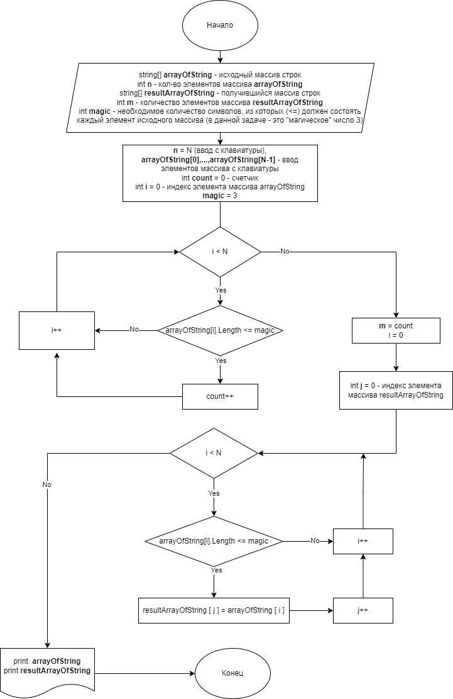

### Итоговая контрольная работа по прошествию 3 месяцев обучения (IT-специалист)   

#### Решаемая задача состоит в том, чтобы найти строки из массива, у которых длина - равна или менее 3 символов, и создать новый массив только из коротких (<=3) элементов исходного массива.
- *Задача решена с использованием массивов строк*.
- Ввод количества элементов и самих элементов исходого массива осуществляется с клавиатуры.
- Для определения длины нового массива производится поиск требуемых строк (длина меньше 3 символов), считается их количество.
- Исходя из условия задачи(опираясь на пример), в случае обнаружения пустого элемента, массив также будет создан, либо пустая строка также должна быть записана в новый массив. Если в исходном массиве нет ни одной строки, удовлетворяющей условиям, создаётся пустой результирующий массив.
- **После поиска количества необходимых строк создаётся новый массив c длиной, равной этому количеству.**
- В результирующий массив переносятся все строки, состоящие из 3 или менее символов.
- Ниже представлена блок-схема алгоритма:

